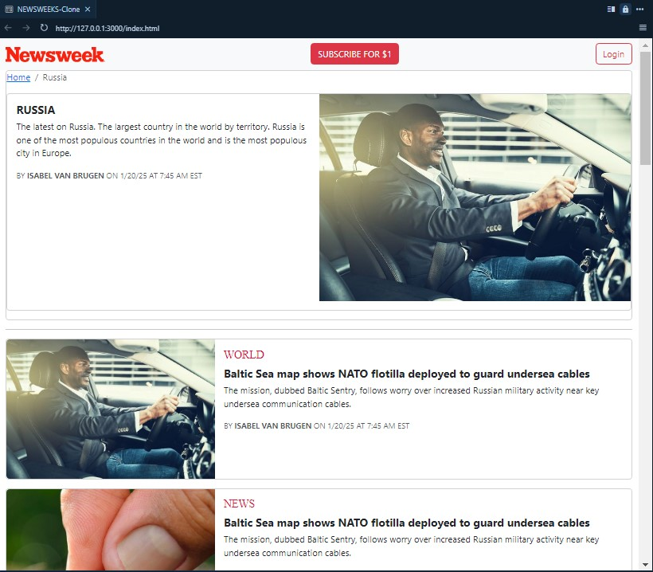
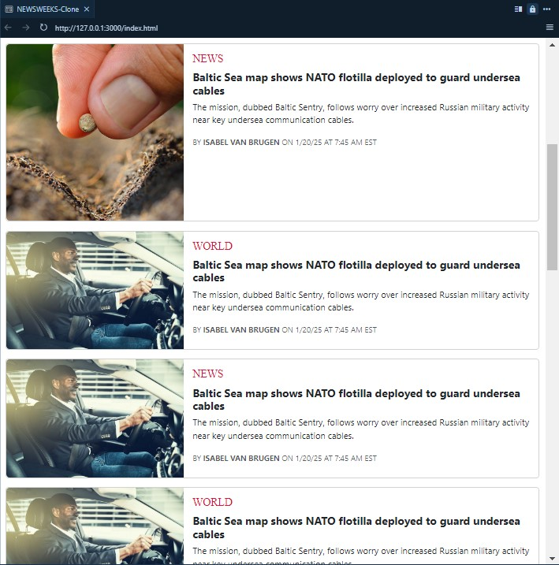

# NEWSWEEK Bootstrap Clone

## Table of Content
- [Description](#Description})
- [How to Use](#How_to_Use)
- [Screenshot](#Screenshot)
- [Download](#Download)

## Description
NEWSWEEK website clone with HTML, CSS nad Bootstrap5.

## How to Use
- To clone and run this project locally, you need Git and any code editor installed on your computer.
- Install BOOTSTRAP5 or use link form Bootstrap website
- Check Bootstrap documentation to understand use of bootstrap classes and styles.

## Screenshot

## Download
You can download or clone the latest update of this project from the download option in GitHub.

## Thanks 
